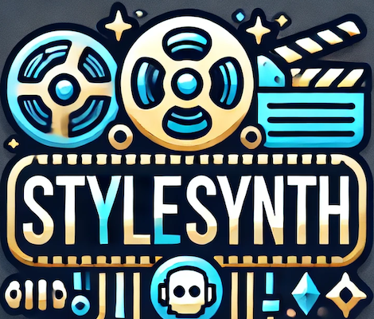
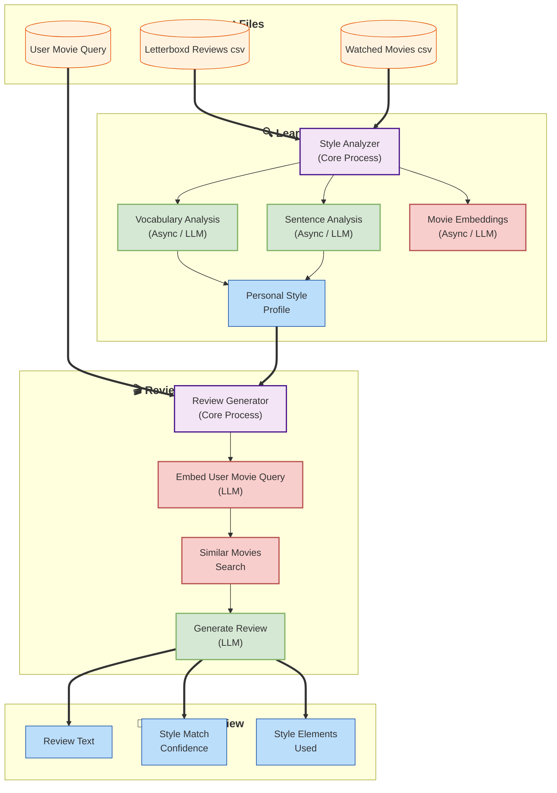

# StyleSynth 


[](https://github.com/xXJohamXx/StyleSynth//actions/workflows/ci-cd.yml)
[](https://opensource.org/licenses/MIT)
[](https://www.python.org/downloads/release/python-390/)



🎬 **Hey there, Movie Buff!** 🍿

Do you use [Letterboxd](https://letterboxd.com/) to track and review all the amazing films you've watched? 🎥✨

Ever found yourself wondering what to do with all that user data you've generated? 🤔💭

How about **spicing things up** by generating personalized movie reviews that reflect *your* unique writing style, all thanks to cutting-edge LLM models? 🖋️💡

Got an OpenAI API key and a few spare coins for tokens? 💰🔑

**Well, you’re in luck!** 🎉

Introducing **StyleSynth** – your new best friend in the world of movie reviews! 🎊

This Python tool analyzes your personal Letterboxd review style and whips up LLM-powered movie reviews that are tailored to sound just like you! 🤖🎞️

This project is not just a tool; it’s a **proof of concept** showcasing the power of NLP and LLMs to create something fun and useful for all you movie enthusiasts out there! 🌟

**Stay tuned for more features and improvements!** 🚀

## Features

- Analyzes Letterboxd reviews to understand writing style
- Identifies common patterns in reviews
- Uses OpenAI's GPT models for personalized review generation
- Vector similarity search for finding similar movies that you've watched

## Quick Start

### Prerequisites
- Python 3.11 or higher
- Poetry (Python dependency management tool)
- OpenAI API key
- Download Letterboxd user data and store in `data/letterboxd` (reviews.csv and watched.csv)

### Installation

1. **Install Poetry** (if not already installed):
   ```bash
   pip install poetry
   ```

2. **Clone and Set Up the Project**:
   ```bash
   # Clone the repository
   git clone https://github.com/xXJohamXx/StyleSynth.git
   cd stylesynth

   # Install dependencies using Poetry
   poetry install
   ```

3. **Set Up Environment Variables**:
   ```bash
   # Option 1: Create or overwrite .env file
   echo "OPENAI_API_KEY=your-api-key-here" > .env

   # Option 2: Manually create .env file
   # Create a new file named .env and add your API key:
   OPENAI_API_KEY=your-api-key-here
   ```

   Replace `your-api-key-here` with your actual OpenAI API key.

### Simple Usage Example

1. **Check out the example script**  [`demo_review_generator.py`](demo_review_generator.py) which demonstrates basic usage of the library.

2. **Run the script using Poetry**:
   ```bash
   poetry run python demo_review_generator.py
   ```

Note: Make sure you have set up your OpenAI API key in the `.env` file before running the example.


Contributions are welcome! Please feel free to submit a Pull Request.


## System Architecture


### System Architecture Legend

| Type | Description |
|:---:|:---|
| 📁 | **Input Files (Orange)**  - CSV files and user movie query |
| ⚙️ | **Core Processes (Purple)** - Main processing components |
| 🤖 | **LLM Operations (Green)** - Language model interactions |
| 🔄 | **Vector Store Operations (Red)** - Embedding and similarity search |
| 📝 | **Output (Blue)** - Generated review and analysis |


## License

This project is licensed under the MIT License - see the [LICENSE](LICENSE) file for details.
